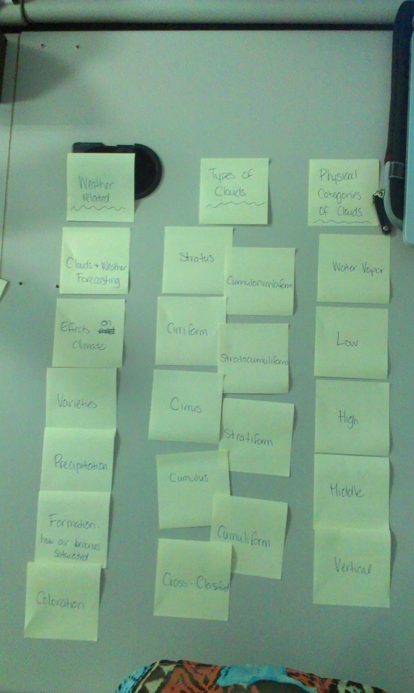
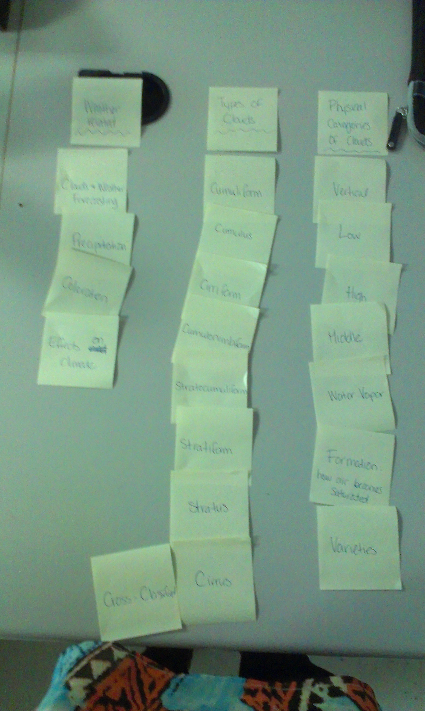

# Card sort report

The purpose of this card sort was to determine common navigation patterns and categories from the content of Clouds.

## Specifics

The card sort was conducted by Cassandra Chartrand on September 10th 2013 between the times of 9:00am and 10:00am with the following participants:

- Emily Barclay
- Lisa Beaton

### Cards

Twenty cards were used covering a broad range of applicable content for the website. The following topics were used as cards:

1. Cumulus
2. Stratus
3. Cirrus
4. Precipitation 
5. Cirriform
6. Cumuliform
7. cumulonimbiform
8. stratiform
9. stratocumuliform
10. cross-classified
11. High
12. Middle
13. Low
14. Vertical
15. Clouds and Weather Forecasting
16. Coloration
17. Effects on Climate
18. Varieties
19. Water Vapor
20. Formation

## Card sort results

Weather related
	- Clouds and Weather Forecasting
	- Effects on Climate
	- Varieties
	- Precipitation
	- Formation
	- Coloration
	
Types of Clouds
	- Cumulus
	- Stratus
	- Cirrus
	- Precipitation 
	- Cirriform
	- Cumuliform
	- cumulonimbiform
	- stratiform
	- stratocumuliform
	- cross-classified
	
Physical Categories of Clouds
	- Water Vapor
	- Low
	- High
	- Middle
	- Vertical
	
*Card sort 1 by Emily Barclay*

Weather related
	- Clouds and Weather Forecasting
	- Effects on Climate
	- Precipitation
	- Coloration
	
Types of Clouds
	- Cumulus
	- Stratus
	- Cirrus
	- Precipitation 
	- Cirriform
	- Cumuliform
	- cumulonimbiform
	- stratiform
	- stratocumuliform
	- cross-classified
	
Physical Categories of Clouds
	- Water Vapor
	- Low
	- High
	- Middle
	- Vertical
	- Varieties
	- Formation

*Card sort 2 by Lisa Beaton*

## Observations

- Did the participants have any common comments?
	Both participants didn't seem to have many comments, they were able to figure out most of the cards on their own.
- Did they have questions that stood out?
	Some of the terms were more scientific and they weren't sure what they were, which is when I needed to help them out.
- Did they struggle with certain articles or topics?
	They mostly struggled with the types of clouds, because of the terms used.
- Were some of the groupings completely unexpected?
	Not really.
- Were the results similar to your expectations?
	Yes, most of it was straight forward.
- How did you feel while watching them perform the task?
	Good, they performed the card sorting a lot better than I thought they would.